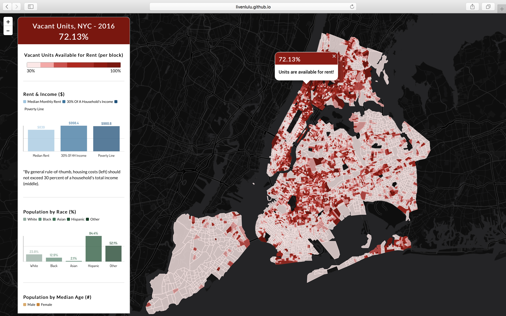

## [Vacant Units in NYC, 2016](http://livenlulu.github.io/vacantnyc/)

<kbd>
</kbd>
  
Features: Bootstrap, Leaflet, NVD3

Data: Vacant Units for Rent, 2016, Median Income, 2016, Population by Race, 2016, Population by Median Age, 2016

Data source: Bureau of the Census 2010 Census PL 94 – 171 files for April 1, 2010, Population Estimates Program supplies various input files for age sex race as of 4/1/2010, ACS survey data (5 year version) has been used for a Summary type file and substitutes on an annual basis the previous decennial SF3 files.